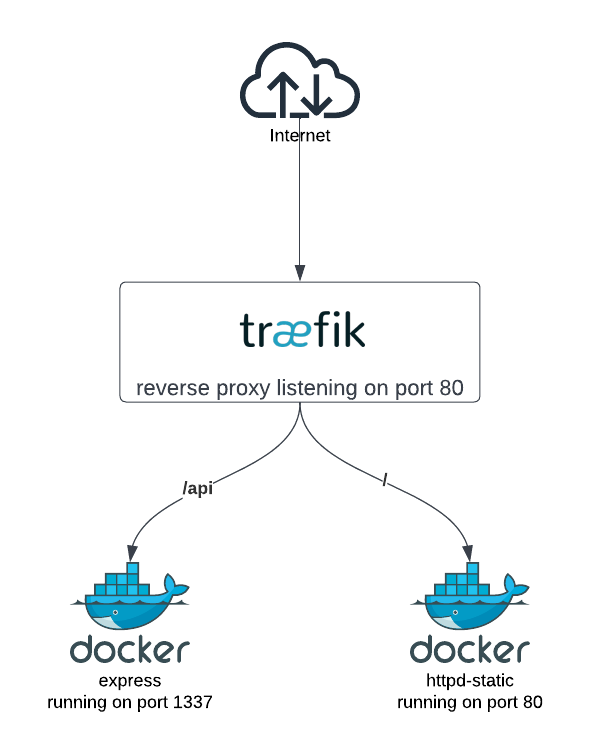
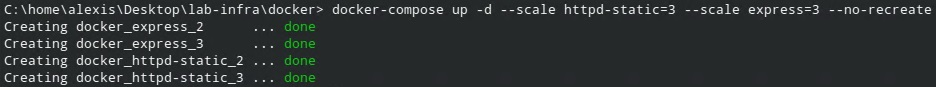
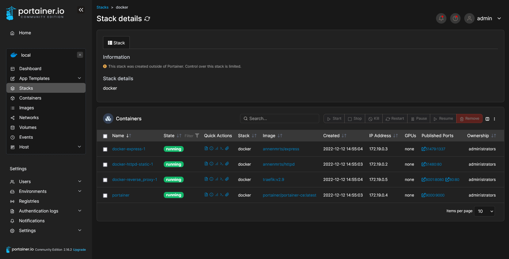

# Laboratoire n°5 - HTTP Infrastructure

Ce rapport concerne le cinquième laboratoire du cours de DAI qui a lieu à l'HEIG-VD.
Nous avons dû réaliser une infrastructure web complète composée de serveurs web statiques et dynamiques, ainsi qu'une page de monitoring.

Pour la réalisation de ce laboratoire, nous avons utilisé l'outil Docker pour mettre en service nos divers serveurs. Le but étant de pratiquer davantage cet outil et de pouvoir lancer rapidement notre infrastructure en quelques lignes.

# Étape 1 : Serveur HTTP statique avec apache httpd

Dans un premier temps, nous avons dû créer notre propre image Docker. Nous nous sommes basés sur l'image `httpd:2.4`. Dans notre image deux types de fichiers y sont copiés.

- Le contenu du site qui est dans le dossier [public_html](./docker/httpd/public_html/) sur l'hôte que l'on copie dans le dossier 'htdocs' du container. Nous avons décidé d'utiliser un site de [démonstration](https://www.tailwindtoolbox.com/templates/admin-template)
- La configuration du serveur web qui est dans le fichier [httpd.conf](./docker/httpd/httpd.conf) sur l'hôte et qui est copié dans le dossier des configurations ('conf') sur le container.

Ainsi avec ces deux fichiers, nos utilisateurs peuvent définir ce que leur site contiendra et la configuration générale du serveur sans avoir à se connecter directement dans le container. On remarque aussi que dans le fichier le port 80 est exposé, cela indique simplement à Docker que le container écoute sur ce port pour les connexions TCP.

Il ne reste plus qu'à construire l'image grâce au fichier [build-image.sh](./docker/build-images.sh). Cette étape sera à réaliser à chaque fois que l'on présentera des images personnalisées dans les futures étapes.

```
./build-image.sh
```

Finalement, on peut démarrer une instance de notre image localement grâce à la commande suivante.

```
docker run -p 8080:80 annenmrts/httpd
```
Le site est maintenant accessible via un navigateur à l'adresse [localhost:8080](http://localhost:8080). La commande indique que le port 8080 est utilisé sur la machine hôte pour le container qui lui écoute sur le port 80. Le site est accessible et fonctionnel.


# Étape 2 : Serveur HTTP dynamique avec express.js

Dans cette partie, le but est de générer un site qui propose du contenu dynamique lorsque l'on rafraîchit la page. Pour cette partie, nous avons aussi dû créer notre propre image. Nous nous sommes basés sur la dernière version de l'image node, c'est-à-dire `node:latest`.

Comme pour la version statique du site, il faut copier le contenu que le container va exécuter dans celui-ci lors de son build. Dans ce cas, c'est le dossier [app](./docker/express/app/) qui sera copié dans le dossier `app` du container. On définit d'ailleurs ce dossier comme le `WORKDIR` du container. Cela veut dire que lorsque le container exécutera des commandes, il les réalisera dans ce dossier.

Pour les commandes qui se réalisent, on en retrouve deux dans notre fichier.

- Installation des dépendances de l'application (`npm install`).
- Exécution du fichier JavaScript avec le contenu du site grâce à la commande `CMD`.

Une fois la configuration réalisée, on peut construire l'image comme lors de la première étape. On peut ensuite lancer le container grâce à la commande ci-dessous.

```
docker run -p 1337:1337 annenmrts/express
```

Le site est lui aussi accessible via un navigateur avec l'adresse [localhost:1337/account](localhost:1337/account). Nous avons décidé de générer les données directement dans le répetoire `account`, c'est pour cette raison que celui-ci figure dans le lien. Concernant ces données, elles sont tirées de la libraire [Faker](https://fakerjs.dev/) qui nous permet d'avoir de fausses données.


# Étape 3(a) : Mise en place d'un fichier docker-compose

Afin de faciliter le déploiement de nos applications ainsi que la mise en place future du reverse proxy nous allons utiliser `docker-compose`. Nous pouvons ainsi configurer nos deux services : `httpd-static` et `express` de telle manière à ce qu'ils puissent communiquer sur leurs ports respectifs (à savoir 80 et 1337). On peut entre autre aussi définir une politique à appliquer en cas de crash dans le conteneur via la directive `restart`, dans notre cas, quel que soit le service, celui-ci redémarre sauf si nous avons demandé expressément de l'arrêter. On peut aussi choisir un réseau dans lequel nos conteneurs pourront communiquer avec la directive `networks`.

Pour démarrer les conteneurs configurés dans le fichier `docker-compose.yml`, il suffit d'exécuter la commande suivante en étant dans le même répertoire que ce fichier: 

```
docker compose up -d
```

Si nous voulons arrêter tous les services :

```
docker compose stop 
```

Pour supprimer les conteneurs créés par notre script :

```
docker compose rm
```

# Étape 3(b) : Reverse proxy avec Traefik

Nous allons maintenant configurer un reverse proxy afin que celui-ci reçoivent toutes nos connexions et les redirige aux bons conteneurs. Nous allons utiliser Traefik, c'est un reverse proxy moderne orienté cloud et écrit en Go. 

Le reverse proxy nous permet d'améliorer entre autre la sécurité, la scalabilité et les performances de notre infrastructure :
 - Load-balancing (répartition des charges)
 - Caching
 - Pas d'exposition des adresses IP des services directement.

Voici l'infrastructure (à cette étape) que nous allons réalisé :



## Configuration

Pour configurer Traefik, nous n'avons pas besoin de créer une image, nous avons entièrement fait la configuration dans le fichier `docker-compose.yml`.  

Nous avons donc lié le service au port 80 (HTTP) et un port de gestion (8001) avec la directive `ports`.

Communiquer avec le port de gestion nous permet d'avoir une interface de monitoring sur les services gérés avec le reverse proxy. En plus d'être bind dans le fichier de configuration, on doit ajouter dans la directive `command` le flag `--api.insecure=true`. Dans un contexte de production, il sera nécessaire de soit désactiver cette interface ou alors ne pas rendre l'accès public.

Le flag `--providers.docker` permet à Traefik que nous utilisons des conteneurs docker et qu'ils puissent utiliser les API dont il a besoin pour communiquer avec.

Le flag `--accesslog=true` indique qu'il faut logger (par défaut dans la sortie standard) tous les accès au reverse proxy.

Finalement afin de permettre la communication avec l'API docker et le reverse proxy on doit ajouter la directive suivante : 

```yml
volumes:
    - /var/run/docker.sock:/var/run/docker.sock
```

# Étape 3(c) : Gestion dynamique d'un cluster

Jusqu'à maintenant chaque container n'avait qu'une instance de celui-ci qui était lancée au même temps. Le but de cette étape est de pouvoir avec plusieurs instances d'un même container.

## Lancement de plusieurs instances
La première étape pour avoir plusieurs containers en parallèle est de modifier le fichier [docker-compose](./docker/docker-compose.yml). On avait pour l'instant un mapping des ports entre l'hôte et le container qui se faisait de façon statique comme montré ci-dessous.

```
ports:
  - 8080:80
```

Le problème est que cela n'est plus possible avec plusieurs instances. Les ports utilisés par l'hôte pour chaque instance doivent être différents. On peut alors simplifier l'écriture en retirant le port côté hôte. Cela sera fait automatiquement par Docker pour chaque nouvelle instance.

```
ports:
  - 80
```

On peut maintenant spécifier lors du lancement de fichier `compose` le nombre d'instances de chaque container que l'on souhaite avoir.

```
docker compose up -d --scale httpd-static=3 --scale express=3
```

Une fois cette commande exécutée, on peut remarquer que les six instances demandées se sont exécutées. On remarque aussi le mapping automatique des ports comme annoncé précédemment.


## Gestion du cluster

Pour démontrer le fonctionne du cluster dynamique, on va commencer par lancer une instance de chaque type de site. On vérifiera grâce aux logs de Traefik qu'il n'y a bien qu'un seul site qui est accédé. On procédera ensuite à l'ajout d'autres instances pour vérifier que Traefik s'adapte correctement.

Pour lancer une seule instance de chaque container, on utilise la commande habituelle.

```
docker compose up -d
```

Pour vérifier les accès, on peut vérifier en live les logs du container Traefik. On remarque que c'est toujours la même adresse IP qui est accédée.

``` 
docker logs docker_reverse_proxy_1
```


On peut maintenant augmenter le nombre d'instances qui composent notre infrastructure. Il faut alors lancer la commande de scaling vue précédemment en précisant `--no-recreate` pour ne pas recréer le container qui existe déjà. A noter qu'en cas de suppression, il suffit de préciser le nombre d'instances souhaitées sans arguments supplémentaires.



Si on essaye maintenant d'accéder à nouveau au site en regardant les logs de Traefik, on remarque que les adresses varient. Dans la capture ci-dessous, la ligne rouge indique le moment où l'on a rajouté des instances.


# Étape 4 : Requêtes avec l'API Fetch

Pour cette partie, nous avons repris notre application `express` et avons ajouté un endpoint (`/api/ajax`) permettant d'afficher une page web. Le but étant de montrer comment on peut mettre à jour une page web dynamiquement côté client avec la Javascript Fetch API. Essentiellement ce que le code côté client (sur la page web) fait est de lancer une requête à l'application `express` sur l'endpoint `/api/account` et met à jour la page web avec les nouvelles données toutes les secondes.

# Étape 5 : Répartition de la charge : Round-robin and sticky-sessions

Dans un premier temps, il faut expliquer les deux concepts cités ci-dessus.

- Round-robin : Dans le cas d'une répartition de charge, cela veut dire que les ressources disponibles sont uniformément utilisées. On envoie les requêtes aux serveurs les unes après les autres dans le même ordre. Si on possède trois serveurs nommés de A à C, alors les requêtes sont réparties selon le schéma : A->B->C->A->B->C->... 
- Sticky-sessions : On va utiliser un moyen de marquer la session d'un utilisateur pour qu'à chaque fois que celui-ci revienne on sache quel serveur s'occupait de lui. Dans notre cas, on utilisera les cookies de l'utilisateur. Ainsi on a une connexion avec état et un même client sera toujours déservie par une même instance Docker.

## Round-robin pour les serveurs dynamiques

Il n'y a pas besoin de modifier les configurations faites jusqu'à présent Traefik s'occupant déjà de cela. On voit le principe du tourniquet dans les adresses des serveurs.


## Sticky-sessions pour les serveurs statiques

Pour activer la gestion des sessions, il faut modifier le fichier [docker-compose](./docker/docker-compose.yml) en rajoutant des `labels` au container statique. On active les sticky-sessions et on crée un cookie qui sera stocké sur l'ordinateur de l'utilisateur.

```
- "traefik.http.services.whoami-service.loadBalancer.sticky.cookie=true"
- "traefik.http.services.whoami-service.loadBalancer.sticky.cookie.name=whoami_cookie_name"
```

On remarque sur les logs de Traefik que c'est en effet toujours le même container qui est accédé.


On peut aussi aller observer le cookie qui est stocké dans le navigateur.


Si on supprime ce cookie ou que l'on ferme la session, alors un nouveau cookie sera créé et donc potentiellement un nouveau serveur affecté.

# Étape 6 : Interface web pour le management de l'infrastructure

Nous avons utilisé une solution existante appelée [Portainer](https://www.portainer.io/), celle-ci possède toutes sortes de fonctionnalités en particulier pour la gestion de conteneurs Docker :
 - Arrêt et démarrage de conteneurs
 - Gestion de stack de conteneurs (avec `docker-compose`)
 - Gestion de templates
 - Gestion des images, volumes, networks, etc.

 

 L'application est configurée directement dans le `docker-compose.yml` avec le port 9001.